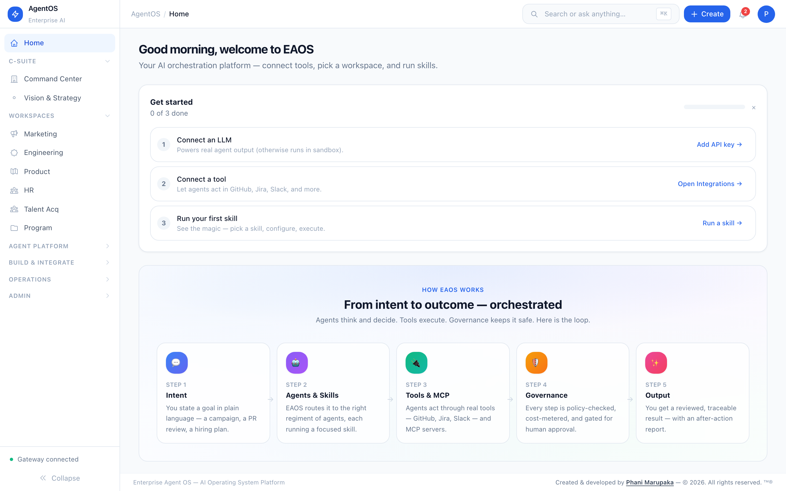

# 🧠 Enterprise Agent OS (EAOS)

> 🚀 **The AI Operating System for Enterprise Teams** — 53 autonomous agents across 5 regiments, orchestrating work through 6 persona workspaces with full governance, observability, and cost control.

EAOS is a **control plane for enterprise work**. Agents think, decide, and orchestrate. Tools execute. Workflows structure. It doesn't replace your tools — it **orchestrates them through intelligent multi-agent collaboration**.

> 🧩 *Think: "Kubernetes for Enterprise Workflows"* — Agents = Pods · Skills = Containers · Workflows = Deployments · MCP = Service Mesh · UTCP = API Schema.

---

## ✨ Highlights

- 🤖 **53 autonomous agents** across 5 regiments (Titan · Olympian · Asgard · Explorer · Eden)
- 🏛️ **Military hierarchy** — General → Field Marshal → Colonel → Captain → Corporal
- 🧰 **60+ pre-built skills** spanning Engineering, Marketing, Product, HR, Talent, PMO
- 🔌 **MCP tool layer** with 8+ adapters (Jira, GitHub, Slack, Confluence, HubSpot, GA4, LinkedIn, Figma)
- 🔄 **A2A protocol** for agent-to-agent delegation, review, critique, escalation
- 📦 **UTCP packets** — universal task context standard for every execution
- 🧭 **5 flagship workflows** — PRD→Jira · Incident RCA · Campaign Launch · Hiring Pipeline · Launch Readiness
- 🎯 **Model router** — Haiku → Sonnet → Opus with cost metering & circuit breakers
- 🛡️ **Governance built-in** — RBAC, audit trail, compliance checks, cost attribution, budget controls
- 📊 **150+ API routes** — fully implemented backend with real persistence

---

## 🧬 Core Loop

```
User Intent → Intent Engine → Workflow Selection → Agent Orchestration (A2A)
   → Tool Execution (MCP) → Output Aggregation → Human Approval → Memory
```

```
Vision → Decomposition → Cascading → Agent Assignment → Skill Execution
   → Output Aggregation → Human Review → After-Action Reports → Learning
```

---

## 🏗️ Platform Capabilities

| Layer | What It Does |
|---|---|
| 🪟 **6 Persona Workspaces** | Engineering · Marketing · Product · HR · Talent · Program Management |
| 🧩 **60+ Skills** | Pre-built execution primitives across all personas |
| 🤖 **53 Agents** | 5 regiments with Colonel → Captain → Corporal hierarchy |
| 📦 **UTCP Protocol** | Universal Task Context Protocol — standardized execution packets |
| 🔄 **A2A Protocol** | Delegate · query · review · approve · critique · escalate |
| 🔌 **MCP Tool Layer** | 8 tool adapters with auth & capability registry |
| 🗣️ **Agent Meetings** | Standup · sprint planning · retrospective · design review · war room |
| 🌐 **Cross-Functional Swarms** | Product launch · incident response · hiring sprint · campaign pods |
| 🎯 **Model Router** | Cost-aware Haiku → Sonnet → Opus routing with circuit breakers |
| 🎨 **Workflow Canvas** | Visual DAG builder for cross-functional templates |
| 📡 **Protocol Monitor** | Real-time UTCP, A2A, MCP, Runtime, Cost dashboards |
| 🛡️ **Governance** | RBAC · audit trails · compliance checks · cost attribution |

---

## ⚡ Quick Start

```bash
# 📥 Clone and install
git clone https://github.com/Phani3108/EAOS.git
cd EAOS
pnpm install

# 🔐 Set up environment
cp deploy/.env.example .env
# Edit .env — add at minimum: ANTHROPIC_API_KEY

# ▶️ Run gateway + frontend
pnpm dev

# 🐳 Or use Docker
docker compose -f deploy/docker-compose.production.yml up -d
```

- 🌐 **Frontend** — http://localhost:3010
- 🛠️ **Gateway** — http://localhost:3000
- 📈 **Grafana** — http://localhost:3001

### ✅ Prerequisites

- 🟢 Node.js >= 20.0.0
- 📦 pnpm >= 9.0.0

---

## 🖼️ Screenshots

### 🏠 Home & C-Suite Command

<table>
<tr>
<td width="33%">

**🎛️ Home Command Center** — Mission control with live agent stats, recent executions, and platform health.



</td>
<td width="33%">

**👔 C-Suite Command Center** — 53 agents across Titan, Olympian, Asgard, Explorer, and Eden regiments.


</td>
<td width="33%">

**🎯 Vision & Strategy** — Create vision statements, decompose into objectives, cascade to regiments with PMO tracking.


</td>
</tr>
</table>

### 👥 Persona Hubs

Each persona hub provides a unified workspace with **Skills → Outputs → Programs → Memory** tabs, a skill configuration form with simulation mode, and a full execution pipeline.

<table>
<tr>
<td width="25%">

**📣 Marketing Hub** — 30 workflows across Campaign, Content, Creative, Event, Research, and Analytics.


</td>
<td width="25%">

**🛠️ Engineering Hub** — 10 skills across Code Review, Testing, Incident Response, and Documentation.


</td>
<td width="25%">

**📐 Product Hub** — PRD Generator, Jira Epic Writer, User Story Builder, Roadmap Planner, and more.


</td>
<td width="25%">

**🧑‍💼 HR & Talent Hub** — Recruiting, onboarding, performance reviews, and talent analytics.


</td>
</tr>
</table>

### 🧠 Platform Intelligence

<table>
<tr>
<td width="33%">

**🤖 Agents Panel** — Monitor 53 autonomous agents with status, model, token usage, and success rates.


</td>
<td width="33%">

**🎓 AI Courses Hub** — Curated courses from 10 platform providers with engagement tracking.


</td>
<td width="33%">

**🧪 Innovation Labs** — Experiment sandbox with hackathons, graduation pipeline, and C-Suite backlog.


</td>
</tr>
<tr>
<td width="33%">

**💰 Budget Intelligence** — Per-agent cost tracking, burn-rate projections, CFO dashboard, and cost alerts.


</td>
<td width="33%">

**📈 Agent Improvement** — Performance reviews, improvement plans, feedback loops, and training exemplars.


</td>
<td width="33%">

**🔌 Tool Registry** — Manage integrations (HubSpot, Jira, GitHub, Slack, Salesforce) with auth and capabilities.


</td>
</tr>
</table>

### ⚙️ Operations & Admin

<table>
<tr>
<td width="25%">

**🔔 Notification Center** — Multi-channel dispatch (Slack, Teams, Email, Webhook) with rules and delivery logs.


</td>
<td width="25%">

**🧾 Executions** — Execution history with status tracking, approval workflows, and after-action reports.


</td>
<td width="25%">

**💬 Discussion Forum** — Threaded discussions with voting, answer acceptance, and community engagement.


</td>
<td width="25%">

**✍️ Blog Editor** — Create, publish, and manage blog posts with tags, destinations, and engagement stats.


</td>
</tr>
<tr>
<td width="25%">

**🛡️ Governance** — License tracking, cost attribution, access management, audit log, and compliance checks.


</td>
<td width="25%">

**📊 Usage & Analytics** — Platform usage stats, adoption metrics, and performance analytics.


</td>
<td width="25%">

**⚙️ Settings** — Platform configuration, environment variables, and system preferences.


</td>
<td width="25%">&nbsp;</td>
</tr>
</table>

---

## 🏛️ Architecture

```
┌─────────────────────────────────────────────────────────┐
│                    Frontend (Next.js 14)                 │
│  Sidebar │ Command Palette │ Main Content │ Right Panel  │
├──────────┴─────────────────┴──────────────┴─────────────┤
│                    Gateway API (Node.js)                 │
│  150+ API routes │ JWT Auth │ Event Bus │ WebSocket      │
├─────────────────────────────────────────────────────────┤
│              Agent Hierarchy (53 Agents)                 │
│  Titan │ Olympian │ Asgard │ Explorer │ Eden Regiments   │
├─────────────────────────────────────────────────────────┤
│  C-Suite Layer │ Vision/PMO │ Innovation │ Budget/Cost   │
├─────────────────────────────────────────────────────────┤
│  Persistence: File-backed │ PostgreSQL │ In-Memory       │
│  Event Bus │ Notification Dispatch │ Webhook Connector   │
├─────────────────────────────────────────────────────────┤
│  Connectors: Jira │ GitHub │ Slack │ Teams │ HubSpot     │
└─────────────────────────────────────────────────────────┘
```

### 🪖 Organizational Hierarchy

- 🏛️ **Board / Vision Layer**
  - 👑 **CEO** — Supreme Commander · Titan Regiment
    - 📣 **CMO** → Olympian Regiment (Marketing)
    - 🛠️ **CTO** → Asgard Regiment (Engineering)
    - 📐 **CPO** → Explorer Regiment (Product)
    - 🧑‍💼 **CHRO** → Eden Regiment (HR & Talent)
    - 💰 **CFO** → Budget Intelligence
    - 📋 **PMO** → Program Management Office

---

## 🌟 Features

### 🔧 Core Platform
- 🤖 **53 Autonomous Agents** across 5 regiments
- 🪖 **Military Hierarchy** — General → Field Marshal → Colonel → Captain → Corporal
- 🛣️ **150+ API Routes** — fully implemented backend with real persistence
- 🔐 **JWT Authentication** — role-based access with persona gating
- 📡 **Event Bus** — in-process pub/sub with pattern matching & dispatch
- 🔄 **WebSocket Streaming** — live execution updates pushed to UI
- 💾 **Three-Tier Persistence** — File-backed JSON · PostgreSQL · In-Memory

### 👔 C-Suite & Vision Layer
- 🎯 **C-Suite Command Center** — CEO, CMO, CTO, CPO, CHRO command their regiments
- 🧠 **Vision & Strategy** — LLM-powered vision decomposition into objectives
- 📥 **Cascading** — objectives flow C-Suite → regiment → agents
- 📋 **PMO Dashboard** — cross-regiment status rollups & program management

### 🏢 Persona Hubs
- 📣 **Marketing** — 30 workflows: Campaign · Content · Creative · Event · Research · Analytics
- 🛠️ **Engineering** — PR Review · Unit Tests · Incident RCA · Architecture Review · 6 more
- 📐 **Product** — PRD Generator · Jira Epics · User Stories · Roadmaps · 6 more
- 🧑‍💼 **HR & Talent** — Recruiting · onboarding · performance reviews · talent analytics

### 🧪 Innovation Labs
- 🔬 **Experiment Sandbox** — create, activate, evaluate, graduate experiments
- ⏱️ **Hackathon Mode** — time-boxed innovation sprints
- 🎓 **Graduation Pipeline** — promote successful experiments to production

### 💰 Budget & Cost Intelligence
- 🪙 **Per-Agent Budgets** — monthly · quarterly · annual allocation
- 📊 **Spend Tracking** — every API call logged with cost, tokens, model, latency
- 🔥 **Burn Rate Analysis** — daily/weekly averages, month-end projections
- 🚨 **Cost Alerts** — threshold, overspend, spike alerts with severity levels
- 🧮 **CFO Dashboard** — total spend, by-regiment breakdown, top spenders

### 📈 Agent Training & Continuous Improvement
- ⭐ **Performance Reviews** — reliability · efficiency · quality · collaboration · cost
- 🎯 **Improvement Plans** — objective-based with metric tracking & auto-completion
- 💬 **Feedback Loops** — positive/negative/correction with sentiment trends
- 📚 **Training Exemplars** — curated executions for agent learning
- 🩺 **Health Reports** — agents needing attention, outcome distributions

### 🔔 Notifications & Webhooks
- 📨 **Multi-Channel Dispatch** — Slack · Teams · Email · Webhook
- 🧠 **Rule Engine** — trigger-based notification routing
- 🔗 **Webhook Connector** — inbound/outbound with HMAC-SHA256 signatures
- 📜 **Delivery Logs** — full audit trail of every notification

### 🛠️ Platform Operations
- 🛒 **Skill Marketplace** — CRUD with voting, comments, analytics, governance
- ⏰ **Scheduler** — cron · interval · event-driven · one-time jobs
- 💬 **Discussion Forum** — threaded conversations with voting & answer acceptance
- ✍️ **Blog Editor** — publish, manage, track engagement
- 📚 **Prompt Library** — fork, pin, upvote curated prompts
- 🔌 **Tool Registry** — manage external connections with OAuth & API key auth

### 🔍 Observability & Governance
- 🧾 **Audit Trail** — every action, handoff, decision logged immutably
- 💸 **Cost Attribution** — per-persona · per-agent · per-task breakdown
- 🔬 **Execution Traces** — token usage, latency, confidence metrics
- 📑 **After-Action Reports** — auto-generated per workflow execution

---

## 🧱 Tech Stack

| Layer | Technology |
|---|---|
| 🎨 **Frontend** | Next.js 14 · React 18 · TypeScript · Tailwind · Zustand · Framer Motion |
| 🛣️ **Gateway API** | Node.js HTTP server · TypeScript |
| 🗄️ **State** | Zustand |
| 🔄 **Data Fetching** | TanStack React Query |
| 📦 **Monorepo** | pnpm workspaces · Turborepo |
| 📐 **Schemas** | JSON Schema (skills · tools · prompts · workflows · workers · policies) |
| 🐘 **Database** | PostgreSQL (Prisma for Prompt Library) |
| 🤖 **Agent Runtimes** | LangGraph (default) · AutoGen · CrewAI · Custom |
| 🔌 **Connectors** | Jira · GitHub · Slack · Confluence · Teams |

---

## 📂 Project Structure

```
EAOS/
├── 🎨 apps/web/                # Next.js 14 frontend
├── 🛣️ services/
│   ├── gateway/                # API gateway (Node.js)
│   ├── orchestrator/           # Mother orchestrator
│   ├── cognitive-engine/       # LLM reasoning
│   ├── reliability-engine/     # Grounding & validation
│   ├── skills-runtime/         # Skill execution
│   ├── learning-engine/        # AI learning engine
│   ├── memory/                 # Memory pipeline
│   └── workspace-api/          # Workspace management
├── 📦 packages/                # 20+ packages (schemas, kernel, knowledge, policy, db, llm…)
├── 🔌 connectors/              # Jira · GitHub · Slack · Teams
├── 👷 workers/                 # Knowledge · incident · transcript workers
├── 🤖 agents/marketing/        # Marketing Agent Graph (SOMAN)
├── 📚 prompt-library/          # Prompt Library (Prisma-based)
└── 📸 docs/screenshots/        # App screenshots
```

---

## 🎬 Running the App

Start the Gateway API and Frontend in two terminals:

```bash
# 🛣️ Terminal 1 — Gateway API (port 3000)
cd services/gateway
npx tsx src/server.ts

# 🎨 Terminal 2 — Frontend (port 3010)
cd apps/web
pnpm dev
```

🌐 Open [http://localhost:3010](http://localhost:3010)

> 👋 First time? An onboarding modal greets you. Use the **Help menu** (top-right) to restart the guided tour anytime. ⌨️ Arrow keys navigate · Esc skips · Enter advances.

---

## 🛣️ API Endpoints (150+)

| Group | Routes | Description |
|---|---|---|
| 🔐 **Auth** | `POST /api/auth/token` · `GET /api/auth/me` | JWT issuance & user info |
| ▶️ **Execution** | `POST /api/execute` · `GET /api/executions[/:id]` | Unified skill execution |
| 👔 **C-Suite** | `GET /api/csuite[/:id[/chain]]` | Agent hierarchy & command chain |
| 🎯 **Vision/PMO** | `POST /api/vision[/:id/decompose,cascade]` | Vision decomposition & cascading |
| 🧪 **Innovation** | `/api/innovation/{experiments,hackathons,graduations}/*` | Innovation labs CRUD + state |
| 💰 **Budget** | `/api/budget/{agents,spend,alerts,dashboard}/*` | Cost tracking & CFO dashboard |
| 📈 **Improvement** | `/api/improvement/{reviews,plans,feedback,exemplars}/*` | Reviews · plans · feedback |
| 🔔 **Notifications** | `/api/notifications/{channels,rules,dispatch}/*` | Multi-channel dispatch |
| 🔗 **Webhooks** | `/api/webhooks/{endpoints,subscriptions,receive}/*` | HMAC-SHA256 signed |
| 🧩 **Skills** | `/api/skills/unified` · `/api/marketplace/skills/*` | Marketplace with voting |
| 🪟 **Personas** | `/api/{engineering,product,hr,marketing}/*` | Persona-gated execution |
| 🤖 **Agents** | `/api/agents/{registry,kpis,memory}` | Registry · KPIs · memory |
| ⏰ **Scheduler** | `/api/scheduler/{jobs,events}/*` | Cron / interval / event-driven |
| 💬 **Blog/Forum** | `/api/{blog/posts,forum/threads}/*` | Content with voting |
| 🧠 **Cognitive** | `/api/cognitive/{process,decompose,reason}` | Multi-step LLM pipeline |
| 🔍 **Observability** | `/api/{governance/audit,events,health}` | Audit · events · health |

---

## 🌐 Marketing Agent Graph (SOMAN)

The **Self-Optimizing Marketing Agent Network** — a collaborative agent system reasoning through shared state:

```
                     🧭 Marketing Orchestrator
                              │
         ┌────────────────────┼────────────────────┐
         │                    │                    │
   🔍 Research          🎯 Strategy          📊 Analytics
         │                    │                    │
         ├──────────┐         │         ┌──────────┤
         │          │         │         │          │
    🔎 SEO    🥊 Competitor   │   ✍️ Copy   📣 Campaign
                              │      │
                              │  🎨 Design
                              │      │
                       📧 Email · 🛬 Landing Page
                                │
                       🔁 Optimization Agent ◀── Feedback Loop
```

🔁 **Optimization loop:** Campaign → Performance Signals → Analytics → Optimization → Strategy Adjust → Creative Regen → New Campaign

---

## 📐 Schemas

All definitions are validated against JSON schemas in `packages/schemas/`:

- 🧩 `skill.schema.json` — Skill definitions
- 🔌 `tool.schema.json` — Tool connectors
- 📚 `prompt.schema.json` — Prompt library entries
- 🔄 `workflow.schema.json` — Workflow definitions
- 👷 `worker.schema.json` — Worker configurations
- 📡 `event.schema.json` — Event types
- 🛡️ `policy.schema.json` — Policy rules
- 🌐 `capability-graph.schema.json` — Tool capability graph

---

## 📜 License

MIT

---

## 👤 Author

**Created & developed by [Phani Marupaka](https://linkedin.com/in/phani-marupaka)**

© 2026 Phani Marupaka. All rights reserved.

> ⚖️ Unauthorized reproduction, distribution, or modification of this software, in whole or in part, is strictly prohibited under applicable trademark and copyright laws including but not limited to the Digital Millennium Copyright Act (DMCA), the Lanham Act (15 U.S.C. § 1051 et seq.), and equivalent international intellectual property statutes. This software contains embedded provenance markers and attribution watermarks protected under 17 U.S.C. § 1202. Removal or alteration of such markers constitutes a violation of federal law.

---

🛠️ Built with **Next.js · TypeScript · Tailwind CSS** — and a lot of AI agents. 🤖✨
